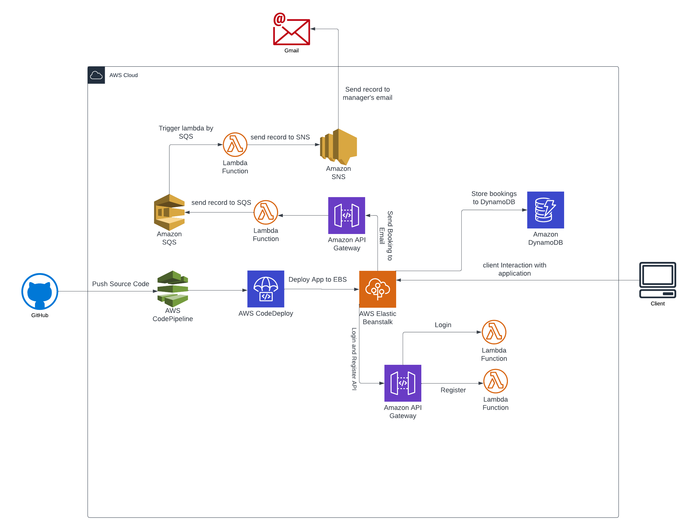

# Hotel Booking System

## How to run Application

- Clone the repository `git clone https://github.com/nitukumarii/hotel-booking-system.git`
- Go inside the project directory 
- Go inside the `frontend` directory and then add the server URL in `.env` file. For example `REACT_APP_SERVER_URL=http://localhost:5000`.
- Change the `proxy` value with Server URL in `package.json` inside frontend directory. For example `"proxy" : "http://localhost:5000"`. The value of proxy is `http://localhost:5000`.
- Change the AWS `ACCESS_KEY` and `SECRET_ACCESS_KEY` inside the `.env` file. This `.env` file exist in root directory of the project.


## Installation
```bash
cd frontend
npm install
npm run build

cd ..

npm install
npm start

```

    
## Cloud Architecture



